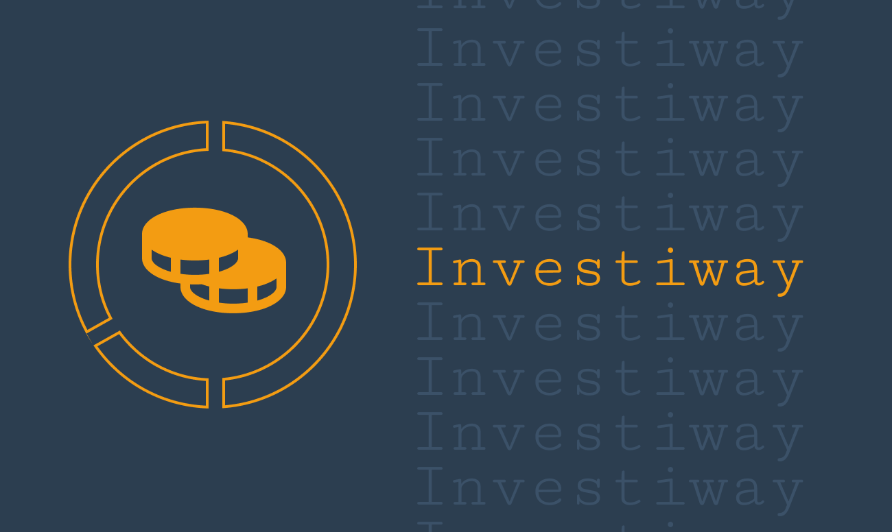

    

# @Investiway Backend
##### Personal finance management.
## Description

**Investiway** is a web application that allows users to keep track of their monthly and weekly expenses, plan their spending for the next month, add new spending categories, and set monthly recurring expenses. The application also provides advice for spending based on user history and allows users to create notes with priorities.

## Installation and Usage
1. Clone the repository
3. Run the development server with **`npm run dev:up`** or **`yarn dev:up`**
4. Open the application in your web browser at http://localhost:8010/documents

## License
This project is licensed under the MIT License - see the LICENSE.md file for details.

